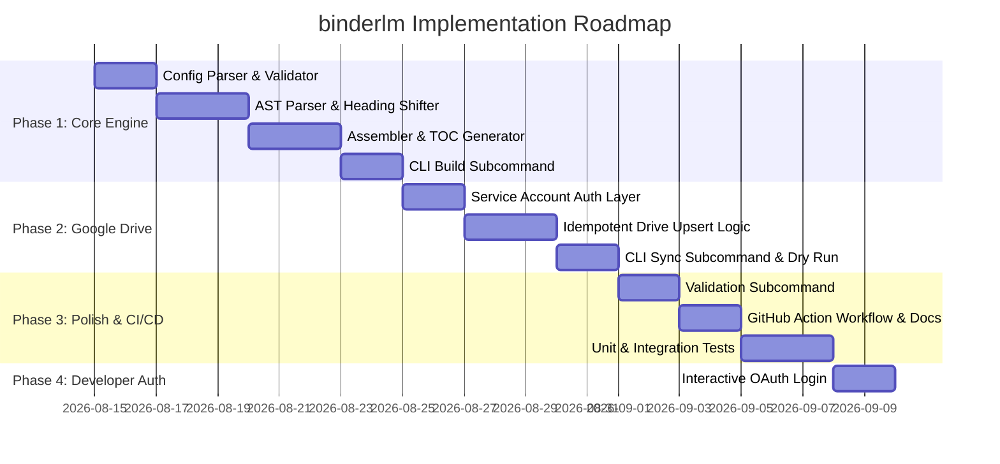

# Product Specification & Technical Design: `binderlm`

**Document Version:** 1.0.0  
**Status:** Approved for Implementation  
**Target Language:** Go (1.26+)  
**Repository:** `binderlm`

---

## 1. Executive Summary & Objectives

### 1.1 Problem Statement
Modern microservice architectures, mono-repositories, and distributed software systems follow the "Docs as Code" pattern. Markdown documentation is decentralized across individual service directories, library packages, and frontend modules.

While this allows engineers to maintain documentation close to the codebase, it creates significant friction for Large Language Model (LLM) workflows—specifically **Google NotebookLM** and Retrieval-Augmented Generation (RAG) pipelines. These systems require a consolidated, hierarchical master document to maintain cross-domain context, resolve cross-service references, and provide comprehensive architectural context.

### 1.2 Solution: `binderlm`
`binderlm` is a fast, standalone Go CLI tool designed to:
1. Traverse, filter, and parse distributed Markdown files via declarative configuration (`binderlm.yaml`).
2. Normalize document structure through AST-aware heading demoting/shifting while preserving code blocks and formatted text.
3. Extract, clean, or format YAML frontmatter into human- and LLM-friendly formats.
4. Annotate sections with provenance/source hints (`> Source: path/to/file.md`) to enable accurate NotebookLM citation.
5. Generate an integrated, clickable Table of Contents (TOC).
6. Idempotently synchronize the compiled master document to a target Google Drive folder via the Google Drive API v3 (as `text/markdown`), enabling single-click refresh in NotebookLM.

---

## 2. Core Personas & Use Cases

### 2.1 User Personas
* **Software Architect / Tech Lead:** Wants an automated, centralized single source of truth for architecture and system specifications in NotebookLM for rapid query answering and onboarding.
* **DevOps / CI/CD Engineer:** Automates the synchronization of documentation artifacts on main branch merges without manual intervention.
* **Developer:** Previews local stitched documentation (`binderlm build`) before pushing changes.

### 2.2 Key Use Cases
* **UC-01 (Local Compilation):** Run `binderlm build -c binderlm.yaml -o output.md` to aggregate local docs for review or local LLM ingestion.
* **UC-02 (CI/CD Sync):** GitHub Action runs `binderlm sync --config binderlm.yaml` on pull-request merge to push updated context to Google Drive.
* **UC-03 (Config Validation):** Run `binderlm validate` to detect broken file paths, invalid glob patterns, or malformed YAML frontmatter.

---

## 3. Functional Requirements

### 3.1 Input & Directory Traversal
* **FR-1.1 (Explicit Files):** Must support direct listing of explicit file paths (e.g. `./docs/architecture.md`).
* **FR-1.2 (Glob Patterns):** Must support standard glob matching (`*.md`, `**/*.md`, `docs/**/*.md`) across nested directories.
* **FR-1.3 (Exclusions & Ignore Rules):** Support excluding specific files or patterns (e.g., `_drafts/*`, `node_modules/*`, `.git/*`).
* **FR-1.4 (Deterministic Ordering):** Within a section, files matched via globs must be sorted alphabetically by path unless an explicit ordering is provided.

### 3.2 Frontmatter & Metadata Processing
* **FR-2.1 (YAML Frontmatter Extraction):** Parse opening YAML frontmatter blocks delimited by `---`.
* **FR-2.2 (Metadata Modes):**
  * `strip` (Default): Remove the frontmatter block entirely from the final markdown body.
  * `table`: Convert key-value pairs into a clean Markdown table placed below the section heading.
  * `keep`: Retain the raw `---` YAML block.
* **FR-2.3 (Fallback Title Resolution):** Document titles must be resolved with the following precedence:
  1. `title` property in YAML frontmatter.
  2. First Heading 1 (`# <Title>`) in the markdown file content.
  3. Formatted filename (e.g. `auth-flow.md` &rarr; `Auth Flow`).

### 3.3 Heading Normalization & Shifting
* **FR-3.1 (Hierarchical Demoting):** Adjust heading levels dynamically based on section hierarchy:
  * Master Document Title: Level 1 (`#`)
  * Section: Level 2 (`##`)
  * Subsection: Level 3 (`###`)
  * Imported File Headings: Demoted by the section offset (e.g., `# Introduction` in Subsection becomes `#### Introduction`).
  * Maximum Markdown heading level must clamp at `######` (H6) to avoid invalid syntax.
* **FR-3.2 (Code Fence Protection):** Code blocks (``` / ````) and indented code blocks must **never** have internal `#` characters modified. AST-based parsing or strict state-machine parsing is required.
* **FR-3.3 (Source Provenance Injection):** When enabled (`inject_source_hints: true`), inject a markdown blockquote beneath the document title:
  ```markdown
  > *Source: `services/auth/docs/login.md`*
  ```

### 3.4 Table of Contents (TOC)
* **FR-4.1 (Automatic Generation):** When `output.generate_toc: true`, generate a nested bulleted Table of Contents after the document header.
* **FR-4.2 (Anchor Slugs):** Generate GitHub/CommonMark-compatible URL anchor slugs for cross-document navigation within the aggregated file.

### 3.5 Google Drive Synchronization
* **FR-5.1 (Raw Markdown Upload):** Upload files using MIME type `text/markdown` to ensure Google Drive does not auto-convert to Google Docs format (which corrupts code syntax and table structures).
* **FR-5.2 (Idempotent Upsert):**
  1. Query the target folder (`'${folder_id}' in parents and name = '${filename}' and trashed = false`).
  2. If found &rarr; Execute `Files.Update` with media stream.
  3. If not found &rarr; Execute `Files.Create` with parent `folder_id` and media stream.
* **FR-5.3 (Authentication Flexibility):**
  * File-based credentials via `GOOGLE_APPLICATION_CREDENTIALS`.
  * In-memory JSON credentials via `GOOGLE_APPLICATION_CREDENTIALS_JSON` environment variable (for CI/CD secrets).
  * Direct folder ID override via `--folder-id` flag or `GDRIVE_FOLDER_ID` environment variable.
* **FR-5.4 (Dry-Run Mode):** Support `--dry-run` to output diff/action statistics without making remote API mutations.

---

## 4. Configuration Schema (`binderlm.yaml`)

```yaml
version: "1"

# Output compilation settings
output:
  filename: "project_context_latest.md" # Name of generated file & Drive file
  title: "Complete System Architecture & Documentation" # Top-level H1 title
  description: "Aggregated engineering documentation compiled for NotebookLM"
  generate_toc: true
  inject_source_hints: true
  frontmatter_mode: "strip" # Options: strip | table | keep
  max_heading_level: 6

# Google Drive sync settings
drive:
  enabled: true
  folder_id: "1A2B3C4D5E6F7G8H9I0J_GOOGLE_DRIVE_FOLDER_ID"
  mime_type: "text/markdown"

# Section hierarchy
sections:
  - title: "Architecture & Overview"
    level: 1
    files:
      - "./docs/architecture.md"
      - "./docs/guidelines.md"

  - title: "Common Library"
    level: 1
    path: "./packages/common/docs"
    pattern: "**/*.md"
    recursive: true
    exclude:
      - "**/_drafts/**"
      - "**/CHANGELOG.md"

  - title: "Microservices"
    level: 1
    subsections:
      - title: "Auth Service"
        level: 2
        path: "./services/auth/docs"
        pattern: "*.md"
      - title: "Payment Service"
        level: 2
        path: "./services/payment/docs"
        pattern: "*.md"

  - title: "Frontend Applications"
    level: 1
    path: "./frontend/docs"
    pattern: "**/*.md"
```

---

## 5. Software Architecture & Package Design

### 5.1 Package Tree
```
binderlm/
├── cmd/
│   └── binderlm/
│       ├── main.go               # Cobra CLI root & entry point
│       ├── auth.go               # 'auth status' subcommand
│       ├── build.go              # 'build' subcommand
│       ├── login.go              # 'login' subcommand
│       ├── logout.go             # 'logout' subcommand
│       ├── setup.go              # 'setup' subcommand
│       ├── sync.go               # 'sync' subcommand
│       ├── validate.go           # 'validate' subcommand
│       └── version.go            # 'version' subcommand
├── internal/
│   ├── config/
│   │   ├── config.go             # Struct definitions & YAML unmarshaling
│   │   ├── env.go                # Env var overrides & .env file loader
│   │   └── validator.go          # Configuration and path validation
│   ├── validator/
│   │   └── validator.go          # Deep path, glob, frontmatter & auth validation engine
│   ├── parser/
│   │   ├── frontmatter.go        # goldmark-meta wrapper & frontmatter stripper
│   │   ├── heading_shifter.go    # Goldmark AST walker for safe heading demoting
│   │   └── reader.go             # File system reader & glob expansion
│   ├── stitcher/
│   │   ├── assembler.go          # Core stitching coordinator
│   │   ├── toc.go                # TOC generation & slug hashing
│   │   └── model.go              # In-memory document representation
│   └── drive/
│       ├── client.go             # Google Drive API client factory
│       ├── auth.go               # 5-tier auth resolution hierarchy & status inspector
│       ├── oauth.go              # Interactive OAuth2 flow & token cache manager
│       ├── paths.go              # Central ~/.config/binderlm/ path & credential loader
│       └── uploader.go           # Search, Create, Update idempotent operations
├── go.mod
├── go.sum
├── README.md
└── SPEC.md
```

### 5.2 Core Components & Interfaces

#### 5.2.1 Parser & AST Manipulation (`internal/parser`)
To guarantee 100% safety when shifting headings and stripping frontmatter without breaking code fences, inline code, or math blocks, `binderlm` utilizes **`github.com/yuin/goldmark`** AST:

```go
type DocumentParser interface {
    Parse(path string, content []byte) (*ParsedDocument, error)
}

type ParsedDocument struct {
    Path        string
    Frontmatter map[string]interface{}
    Title       string
    Body        []byte // Content with frontmatter stripped or transformed
    Headings    []HeadingNode
}

type HeadingNode struct {
    Level int
    Text  string
    ID    string
}
```

#### 5.2.2 Assembler & Stitcher (`internal/stitcher`)
```go
type Assembler struct {
    cfg    *config.Config
    parser parser.DocumentParser
}

func (a *Assembler) Assemble(ctx context.Context) (*CompiledDocument, error)
```

#### 5.2.3 Google Drive Sync (`internal/drive`)
```go
type Uploader interface {
    Sync(ctx context.Context, folderID string, filename string, content io.Reader) (*SyncResult, error)
}

type SyncResult struct {
    FileID     string
    Action     string // "created" | "updated" | "dry_run"
    WebLink    string
    Size       int64
    ModifiedAt time.Time
}
```

---

## 6. CLI Command Specifications

### 6.1 `binderlm setup`
* **Usage:** `binderlm setup [flags]`
* **Description:** Interactive setup wizard that configures Google OAuth Desktop Client credentials (`~/.config/binderlm/client.json`) or Service Account keys (`~/.config/binderlm/service_account.json`).
* **Exit Codes:** `0` on success, `1` on error.

### 6.2 `binderlm login`
* **Usage:** `binderlm login [flags]`
* **Flags:**
  * `--port <port>`: Local callback port for OAuth loopback listener (default `8085`).
  * `--no-browser`: Do not automatically open browser; display URL only.
  * `--client-id <id>`: Custom Google OAuth Client ID override.
  * `--client-secret <secret>`: Custom Google OAuth Client Secret override.
  * `--timeout <duration>`: Maximum wait time for browser authorization (default `3m`).
* **Exit Codes:** `0` on success, `1` on error.

### 6.3 `binderlm logout`
* **Usage:** `binderlm logout [flags]`
* **Description:** Deletes cached OAuth user tokens from `~/.config/binderlm/token.json`.
* **Exit Codes:** `0` on success, `1` on error.

### 6.4 `binderlm auth status`
* **Usage:** `binderlm auth status [flags]`
* **Flags:**
  * `-a, --auth <mode>`: Authentication mode to inspect (`user`, `sa`, or `auto`).
* **Exit Codes:** `0` on success, `1` on error.

### 6.5 `binderlm build`
* **Usage:** `binderlm build [flags]`
* **Flags:**
  * `-c, --config <path>`: Path to config file (default `binderlm.yaml`).
  * `-o, --output <path>`: Override output file path defined in config.
  * `--stdout`: Write stitched markdown directly to standard output.
* **Exit Codes:** `0` on success, `1` on error.

### 6.6 `binderlm sync`
* **Usage:** `binderlm sync [flags]`
* **Flags:**
  * `-c, --config <path>`: Path to config file (default `binderlm.yaml`).
  * `-a, --auth <mode>`: Override auth mode (`user`, `sa`, or `auto`).
  * `-e, --env-file <path>`: Path to `.env` file to load environment variables.
  * `--folder-id <id>`: Override target Google Drive folder ID.
  * `--dry-run`: Perform all parsing and remote checks without uploading.
  * `--keep-local`: Keep the locally generated file after sync.
  * `-o, --output <path>`: Override local output file path when using `--keep-local`.
* **Exit Codes:** `0` on success, `1` on error, `2` on auth error.

### 6.7 `binderlm validate`
* **Usage:** `binderlm validate [flags]`
* **Flags:**
  * `-c, --config <path>`: Path to config file (default `binderlm.yaml`).
  * `--strict`: Treat warnings (such as unmatched glob patterns) as fatal errors.
  * `--check-drive`: Validate Google Drive credentials and folder access.
* **Description:** Performs static analysis on `binderlm.yaml`, checks file/glob resolution, verifies frontmatter validity, and checks Google Drive credentials if configured.
* **Exit Codes:** `0` on success, `1` on validation failure, `2` on auth failure.

---

## 7. Technology Stack & Dependencies

| Purpose | Dependency | Justification |
| :--- | :--- | :--- |
| **CLI Framework** | `github.com/spf13/cobra` | Industry standard for Go CLIs, subcommands, flags, and auto-help. |
| **Configuration** | `gopkg.in/yaml.v3` | Strict YAML parsing with line numbers and validation. |
| **Markdown AST** | `github.com/yuin/goldmark` | High-performance, CommonMark-compliant AST parser. |
| **Frontmatter** | `github.com/yuin/goldmark-meta` | Seamless metadata extraction from Markdown. |
| **Drive API** | `google.golang.org/api/drive/v3` | Official Google Drive v3 client library. |
| **Auth** | `golang.org/x/oauth2/google` | First-party Google OAuth2 and Service Account handling. |
| **Path Globbing**| `github.com/bmatcuk/doublestar/v4` | Full POSIX-compliant glob matching (`**/*.md`). |

---

## 8. Non-Functional Requirements (NFRs)

1. **Performance:** Sub-second execution time for repositories with 500+ markdown files (concurrent file reading and AST parsing).
2. **Idempotency:** Re-running `sync` without changes produces identical file IDs and content in Google Drive without creating orphan duplicates.
3. **Safety & Zero Content Loss:** Under no circumstance should `#` characters inside code snippets, math formulas, or quotes be modified.
4. **Clean Error Reporting:** Errors must provide actionable messages with file paths and line numbers (e.g. `Error in services/auth/docs/api.md: invalid YAML frontmatter on line 4`).
5. **No External Runtime Dependencies:** Single statically compiled binary without dynamic C-bindings (`CGO_ENABLED=0`).

---

## 9. Implementation Roadmap & Phases



### Phase 1: Core Parsing & Local Assembly
* Implement `internal/config` (schema, validation, defaults).
* Implement `internal/parser` (goldmark AST heading shifter and frontmatter extractor).
* Implement `internal/stitcher` (assembler, TOC generator, source provenance injection).
* Build `cmd/binderlm/build.go` and verify local aggregation.

### Phase 2: Google Drive Integration
* Implement `internal/drive` (Service account credentials via file and env string).
* Implement idempotent search and upsert logic via Google Drive API v3.
* Add user-friendly diagnostic guidance for personal Google Drive quota limits.
* Build `cmd/binderlm/sync.go` with `--dry-run` support.

### Phase 3: Validation, CI/CD & Testing
* Implement `cmd/binderlm/validate.go`.
* Implement comprehensive test suite (unit tests with fixtures, AST golden tests).
* Create GitHub Actions workflows for automated releases and documentation sync.

### Phase 4: Interactive OAuth, Setup Wizard & Developer Experience
* Implement interactive setup wizard `binderlm setup` to configure Desktop OAuth Client credentials or Service Account keys into `~/.config/binderlm/`.
* Implement `binderlm login` and `binderlm logout` commands for local interactive OAuth2 authentication.
* Support secure token caching in `~/.config/binderlm/token.json` (`0600`) so personal Google Drive users can sync and create files directly using personal Drive storage quota without Service Account setup.
* Introduce `binderlm auth status` command and `-a, --auth <user|sa>` mode override for inspecting and selecting active auth sources.
* Formulate and document the **Hybrid Personal Drive + CI/CD Workflow** pattern to solve Google Drive's 0-quota limitation for automated pipelines.
